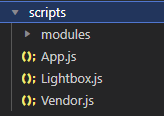
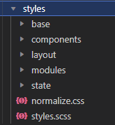

# Development Portfolio - Tim Wilburn

<!-- -   [Development Portfolio - Tim Wilburn](#development-portfolio---tim-wilburn) -->

-   [About](#about)
-   [Technical Summary](#technical-summary)
-   [Project Structure](#project-structure)
    <!-- -   [Using the Portfolio Projects](#individual-projects) -->
    <!-- -   [Development](#development)
        -   [Installation](#installation)
        -   [Running](#running)
        -   [Building](#building)
        -   [Deployment](#deployment) -->

## **About**

> I'm a self taught developer with a passion for developing a better world through technology. I'm currently working on a few projects that I hope to share with the world soon. I'm also looking for a job in the tech industry. If you're interested in hiring me, please reach out to me at timwilburn8@gmail.com

This site serves first and foremost as a portfolio for my work. It also serves as a demonstration of foundational web development skills, advanced styling, project architecture, and Object Oriented Programming demonstrated with JavaScript.

## **Technical Summary**

-   The site is a custom codebase compiled and built with Webpack and deployed to Netlify through continuous integration with a github repository.

-   It is built with HTML, CSS, and JavaScript (JQuery being removed slowly).

-   The project is built with a mobile first approach. The mobile styles are defined first and then custom media queries are used to add styles for larger screens using custom mixins and variables.

## **Project Structure**

-   `app` contains the HTML markup.
    -   Styles and JavaScript code are considered assets and live in the `assets` folder.
-   `dist` is the folder that is deployed to Netlify. It is the compiled and minified version of the codebase. It is deleted and generated by Webpack on each build.
-   `configs` contains the webpack configuration files for processing the HTML, minifying code and images, and compiling SCSS and JSes6.
     

### **_JavaScript_**

-   The project is built with an object oriented approach. The JavaScript features are each organized into classes then instantiated conditionally and used in the main index.js file.

    

    -   Each module represents a feature or utility of the site. The modules are imported into the main `index.js` file and instantiated conditionally based on the presence of the appropriate HTML markup.

     

-   HTML forms are hooked up to a Netlify form submission service for easy integration and robust form handling features.

    <!--   -->

### **_Styles_**

-   Styles are developed using an Object Oriented CSS approach with a BEM naming convention (Block Element Module). The styling is broken into categories and then instantiated in the main `styles.scss` file. Styling features can be added by simply defining your styles in the appropriate category, following the naming conventions, then including your import in the main category file. The categories are as follows:

    -   The styles are organized into a base folder, a components folder, and a layout folder. The base folder contains styles that are applied globally. The components folder contains styles that are applied to individual components. The layout folder contains styles that are applied to the layout of the page.

        

    -   Each style folder contains a main file that imports all of the styles in the folder. The main file is then imported into `styles.scss` (which is subsequently compiled into CSS by webpack).

<!-- ## **Individual Projects**

 

### **Tinyhouse**

**_Overview:_** Tinyhouse is a full stack web application built with React, Node, Express, and MongoDB. It is a clone of the popular Airbnb website. It is a platform for users to list their homes for rent and for users to book homes for rent. It is a full stack application that includes a server, a database, and a client. It is deployed to Heroku and AWS.

**_How to use it:_**

**_Links:_**

-   [Live Site](https://tiny-house-app.com)
-   [Client Code Repo]()
-   [Server Code ]() -->
